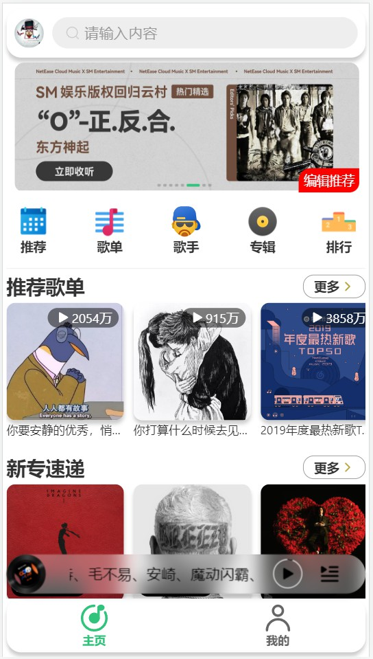
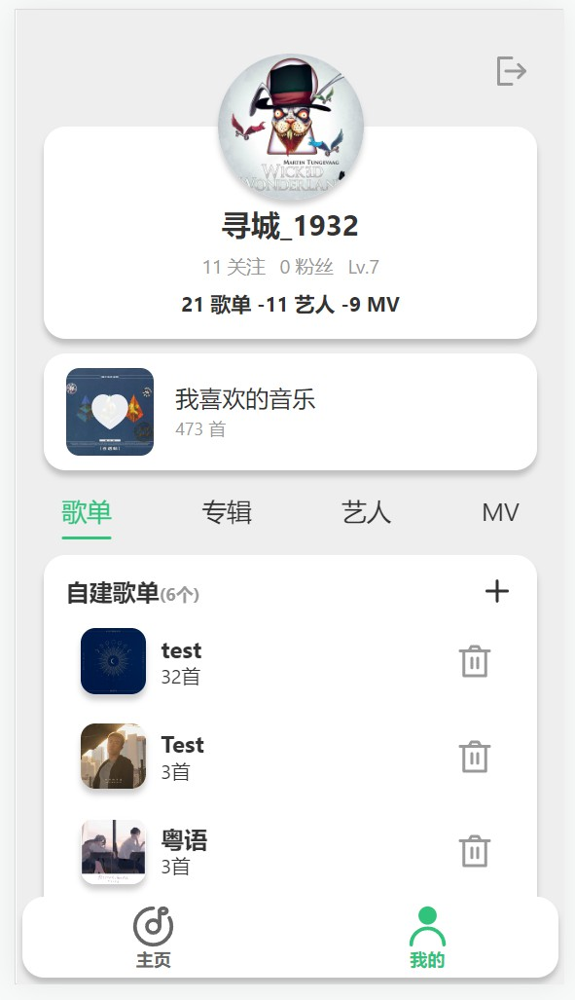
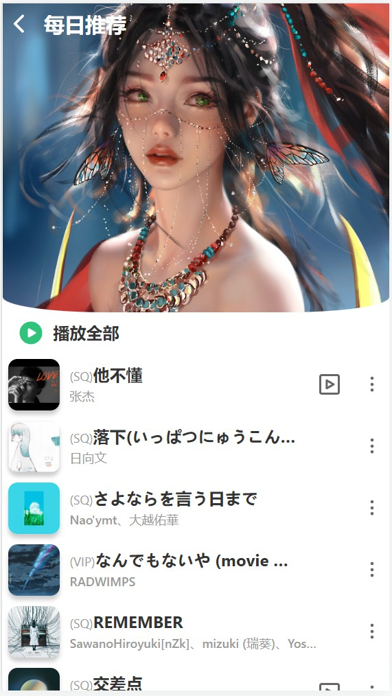
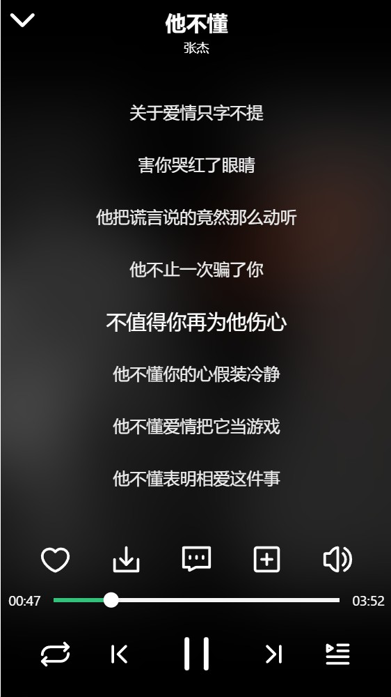
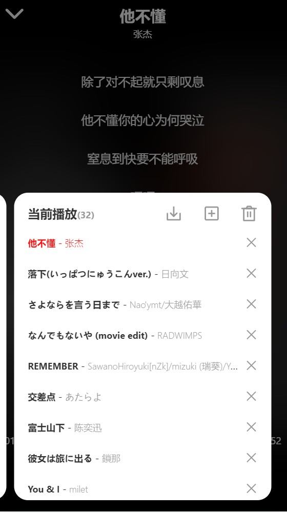
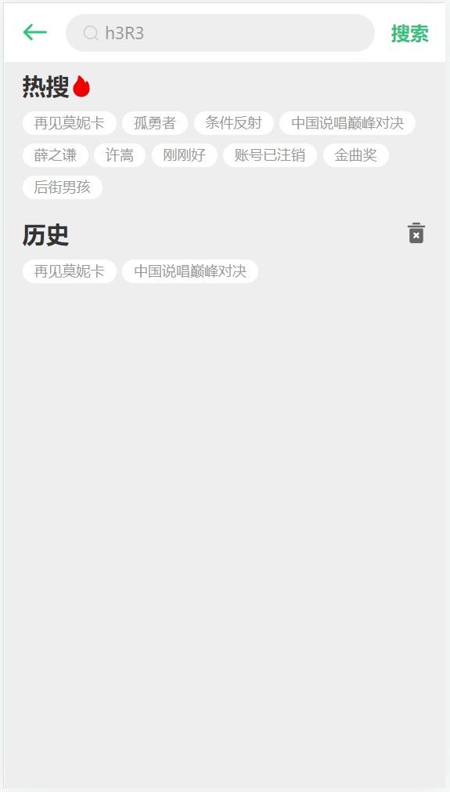
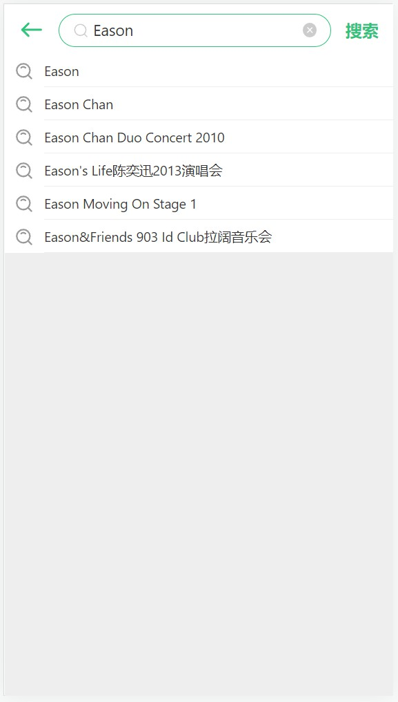
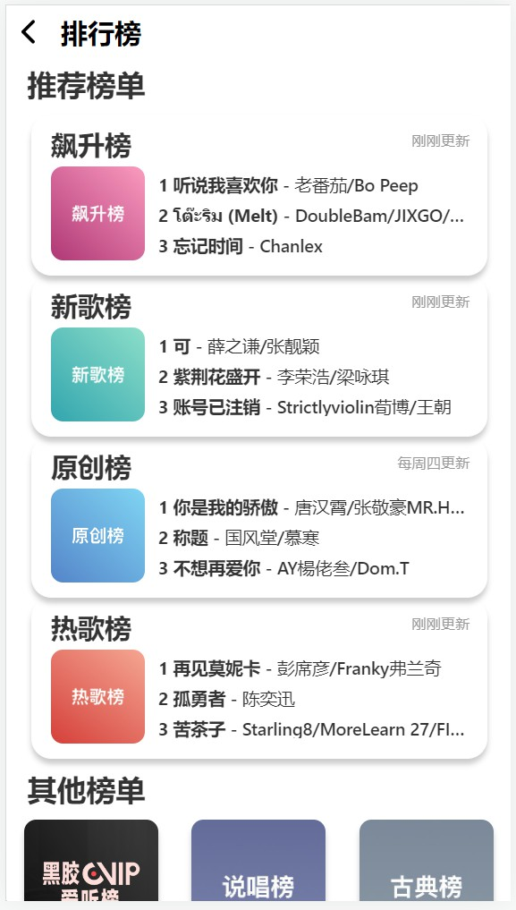

<br />
<p align="center">
  <a href="http://www.xuncheng1932.online" target="blank">
    
  </a>
  <h2 align="center" style="font-weight: 600">xcmusic(寻城音乐)</h2>
</p>

<p align="center">
    web移动端个人音乐播放器
    <br />
    <a href="http://www.xuncheng1932.online" target="blank"><strong>🌎 访问DEMO</strong></a>  
</p>

##  特性
### 技术特性
-  技术栈：React + React Router + Redux +AntD Mobile 全家桶
-  滚动特效：better-scroll
-  图片懒加载：react-lazy-load-image-component
-  视频播放：plyr
-  图标库：IconPark + AntDMobileIcons
### 功能特性
-  支持网易云账号登录（手机/邮箱登录）
-  支持每日推荐歌曲
-  支持搜索(歌单、专辑、艺人)
-  支持歌词显示
-  支持 MV 播放
-  支持歌曲下载

详细功能参考下方截图或在线体验

##  截图
<h3>主页、用户中心、每日推荐</h3>
<p align="center">
    
    
    
</p>
<h3>播放器、歌词、播放列表</h3>
<p align="center">
    
    
    
</p>
<h3>搜索、搜索推荐、搜索结果</h3>
<p align="center">
    
    
    
</p>
<h3>歌单广场、热门歌手、新专速递</h3>
<p align="center">
    
    
    
</p>
<h3>排行榜、歌单详情、专辑详情</h3>
<p align="center">
    
    
    
</p>
<h3>歌手详情、排行榜详情、MV</h3>
<p align="center">
    
    
    
</p>


## 下载运行
### 下载
```js
git clone https://github.com/xc1932/xcmusic_mobile_react.git
```
### 安装依赖
```js
npm install
```
### 运行
```js
npm start
```
### 打包
```js
npm run build
```
## 开源许可
本项目仅供个人学习研究使用，禁止用于商业及非法用途。
基于 [MIT license](https://opensource.org/licenses/MIT) 许可进行开源。

## 灵感来源
API 源代码来自 [Binaryify/NeteaseCloudMusicApi](https://github.com/Binaryify/NeteaseCloudMusicApi)
- [QQ音乐](https://y.qq.com)
- [网易云音乐](https://music.163.com)
- [酷狗音乐](https://m.kugou.com)
